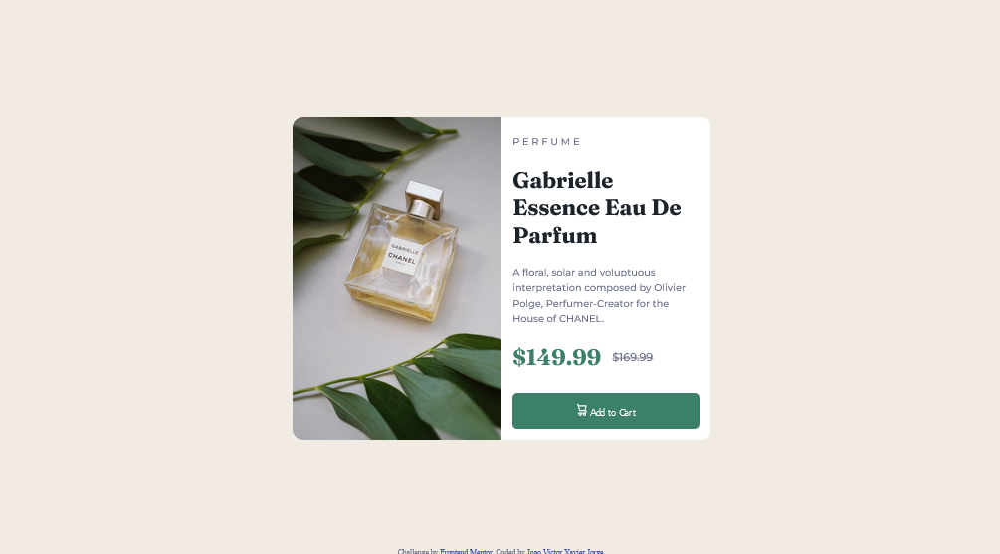
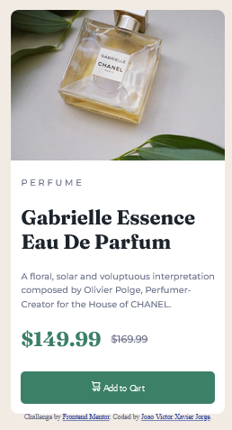

# Frontend Mentor - Product preview card component solution

This is a solution to the [Product preview card component challenge on Frontend Mentor](https://www.frontendmentor.io/challenges/product-preview-card-component-GO7UmttRfa). Frontend Mentor challenges help you improve your coding skills by building realistic projects. 

## Table of contents

- [Frontend Mentor - Product preview card component solution](#frontend-mentor---product-preview-card-component-solution)
  - [Table of contents](#table-of-contents)
  - [Overview](#overview)
    - [The challenge](#the-challenge)
    - [Screenshot](#screenshot)
    - [Links](#links)
  - [My process](#my-process)
    - [Built with](#built-with)
    - [What I learned](#what-i-learned)
    - [Useful resources](#useful-resources)
  - [Author](#author)

**Note: Delete this note and update the table of contents based on what sections you keep.**

## Overview

### The challenge

Users should be able to:

- View the optimal layout depending on their device's screen size
- See hover and focus states for interactive elements

### Screenshot

<p align="center">
  
</p>

<p align="center">
  
</p>

### Links

- Solution URL: [Frontend Mentor](https://www.frontendmentor.io/solutions/product-preview-card-component-solution-vUHjoaCU4I)
- Live Site URL: [Product Preview](https://product-preview-card-component-btc6p9g1c-jxavierjorge.vercel.app/)

## My process

### Built with

- Semantic HTML5 markup
- CSS custom properties
- Flexbox

### What I learned


Using Flexbox to center sections

```css
body {
  display: flex;
  flex-direction: column;
  justify-content: center;
  align-items: center;
  background: hsl(30, 38%, 92%);
  color: hsl(228, 12%, 48%);
  min-height: 100vh;
}
```

Using media queries to set a responsive design

```css
@media (max-width: 500px) {
  section,
  #preview {
    display: flex;
    flex-direction: column;
    margin-top: 1rem;
    margin-bottom: 2rem;
    width: 340px;
    background: hsl(0, 0%, 100%);
    border-radius: 12px;
  }

  img#perfume {
    content: url(./images/image-product-mobile.jpg);
    max-width: 100%;
    height: auto;
    border-radius: 12px 12px 0 0;
  }

  div#text-section {
    padding: 0;
    margin: 0 1rem 1rem 1rem;
  }
}
```

### Useful resources

- [W3Schools](https://www.w3schools.com/html/default.asp) - This helped me showing me how to set an image to be responsive.
- [Dev Ed](https://youtu.be/FTlczfR82mQ) - An amazing tutorial from Ed about the FlexBox subject, overviewing and showing examples and use cases.

## Author

- Frontend Mentor - [@jxavierjorge](https://www.frontendmentor.io/profile/jxavierjorge)
- Linkedin - [@joaovxavierjorge](https://www.linkedin.com/in/joaovxavierjorge/)
